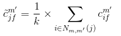
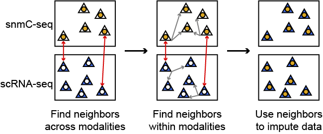
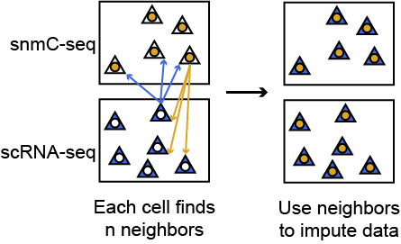

How does SingleCellFusion work?
================================
SingleCellFusion is built around the idea that for a cell profiled by a given omics technique (RNA-sequencing,
snATAC-sequencing, snmC-sequencing) there are unobserved features of that cell that if sampled would
provide a fuller picture of that cell's identity. For example, if a cell underwent RNA-sequencing we know
what genes are expressed but we don't know the patterns of DNA methylation in that same cell. The methylation
status of DNA in that cell is unobserved, limiting our ability to fully understand the identity of that cell.

In an ideal world we would obtain the transcriptome, methylome, and chromatin accessibility of a single
cell at once, but as the technologies for this type of experiment develop SingleCellFusion can provide a
computational equivalent. SingleCellFusion uses known relationships between different types of multiomics
data to impute unobserved data, enabling the multimodal analysis of a cell's identity.

The core of SingleCellFusion is the generation of a nearest neighbors graph between different data sets.
This graph is generated by finding nearest neighbors using the correlation of counts at highly variable
features. For example, DNA methylation is known to be negatively correlated with gene expression. If a
snmC-seq profiled cell has low methylation at a number of highly variable genes, and a snRNA-seq profiled
cell has high gene expression at those same genes, we can assume that those two cells likely belong to the
same cell type. We use this nearest neighbors graph to generate imputed counts by averaging among a cell's
neighbors in the opposite modality. The actions of SingleCellFusion depend on the type of nearest neighbor
graph specified, and are described below.

Direct mutual nearest neighbors
-------------------------------
.. image:: mnn_direct.png
  :width: 400
  :alt: cartoon of direct MNN

In this method, highly variable features are identified in each data set. On a cell-to-cell basis the
correlation of counts at highly variable features is calculated. These correlation values are used
as the distance metric for identifying mutual neighbors.

Once the correlation is calculated, neighbors across modalities are determined. We require that
each neighbor has to have high correlation between each other. In other words, a snmC-seq profiled
cell can only be a neighbor with a scRNA-seq cell if the methylation levels at the highly variable
features are strongly anti-correlated with gene expression at those same features in the scRNA-seq
profiled cell, and vice versa. This ensures that only strong neighbors are found and that the
nearest neighbors graph is not dominated by noisy or spurious correlations.

Once the neighbors graph is generated imputed counts are generated by the following equation:

.. math::
    \tilde{c}_{jf}^{m'} = \frac{1}{k} \times \sum_{i\in{N_{m,m'}}(j)}c_{if}^{m'}

Where :math:`N_{m,m'}{(j)}` is the set of mutual nearest neighbors in modality *m'* for cell *j*
in modality *m*. *k* is the number of mutual nearest neighbors. :math:`c_{if}^{m'}` are the
observed counts for cell *i* in modality *m'* at features *f* and :math:`\tilde{c}_{jf}^{m'}`
are the imputed counts for cell *j* in modality *m'* at features *f*.

This is the most conservative method for generating imputed counts, only cells that make direct mutual
nearest neighbors will receive imputed data. This method typically leads to good integration but can
result in the loss of large fractions of cells from the analysis if mutual neighbors were not found for them.

Mutual nearest neighbors with rescue
-------------------------------------

As with the direct method, the distances between two pairs of cells is their correlation at
highly variable genes. The only difference with this method is that in addition to a mutual
nearest neighbors graph between modalities, a mutual nearest neighbor graph within each modality
is also generated. This within modality graph allows for imputation to be performed on all cells, by
using the within modality neighbors to determine what the best matched neighbors are across
modalities.

This is a more lenient method for generating imputed counts, and all cells will receive imputed data. This
method will enable all cells to be analyzed, and is our recommended approach.

k-nearest neighbors
-------------------

This is the most relaxed method for generating imputed counts, as all cells will make neighbors in the
opposite data set.
