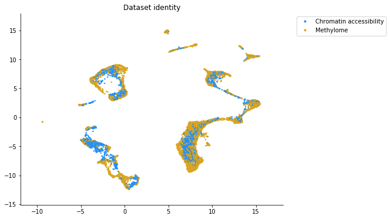

Integration of snmC2T-seq and snATAC-seq data
==============================================

This guide is for those just starting out with SingleCellFusion_Loompy, and demonstrates a multi-omic integration of
single nucleus methylome and chromatin accessibility data. The source of these data are described in
this `bioRxiv preprint <https://doi.org/10.1101/434845>`_.

Data Preparation
----------------
Prior to performing this integration we first generated `Loom <http://linnarssonlab.org/loompy/index.html>`_
files containing the methylome (snmc.loom) and chromatin accessibility (snatac.loom) data. Each loom file has a
base layer containing gene level feature data, where genes are in rows and cells are in columns. Unique gene IDs
are present in a row attribute named 'Accession' and unique cell IDs are in a column attribute named 'CellID.'
There is also a column attribute named 'ClusterID' that contains the unique cluster assignments for each cell
from single modality analyses of each sequencing dataset.

We have also found that it can be useful to lightly smooth data before integration in order to reduce sparseness.
For this analysis we have used our own modified implementation of the
`MAGIC algorithm for smoothing <https://doi.org/10.1016/j.cell.2018.05.061>`_. Our implementation is almost
identical to MAGIC, with the major exception being that we have an additional parameter to specify the relative
contribution of a cell's own counts to the smoothing. Our implementation can be found in `MoP <https://github.com/mukamel-lab/mop/>`_,
SingleCellFusion_Loompy's sister repository of functions used to analyze Loom files::

    import mop
    # Smooth methylome
    mop.smooth.smooth_counts(loom_file='snmc.loom',
                             valid_ca=None,
                             gen_pca=True,
                             pca_attr='PCA',
                             pca_layer='',
                             n_pca=50,
                             drop_first=False,
                             valid_ra=None,
                             gen_knn=True,
                             neighbor_attr='knn_idx_for_smooth',
                             distance_attr='knn_dist_for_smooth',
                             k=30,
                             num_trees=50,
                             metric='euclidean',
                             gen_w=True,
                             w_graph='W_for_smooth',
                             observed_layer='',
                             smoothed_layer='smoothed',
                             ka=4,
                             epsilon=1,
                             p=0.9,
                             batch_size=5000,
                             verbose=True)
    # Smooth chromatin accessibility
    mop.smooth.smooth_counts(loom_file='snatac.loom',
                             valid_ca=None,
                             gen_pca=False,
                             pca_attr='PCA_dropped',
                             pca_layer='log_rpm_observed',
                             n_pca=50,
                             drop_first=False,
                             valid_ra=None,
                             gen_knn=True,
                             neighbor_attr='knn_idx_for_smooth',
                             distance_attr='knn_dist_for_smooth',
                             k=30,
                             num_trees=50,
                             metric='euclidean',
                             gen_w=True,
                             w_graph='W_for_smooth',
                             observed_layer='log_rpm_observed',
                             smoothed_layer='log_rpm_smoothed',
                             ka=4,
                             epsilon=1,
                             p=0.9,
                             batch_size=5000,
                             verbose=True)

Running SingleCellFusion_Loompy
-------------------------
For the purpose of this tutorial we will will generate imputed methylome counts for the snATAC-seq
data, and then we will project the two datasets into a common methylome space. The easiest way to use
SingleCellFusion_Loompy is to use the one step fuse_data function::

    import loompy
    import singlecellfusion as scf

    scf.fuse_data(loom_source = 'snmc.loom',
                  loom_target = 'snatac.loom',
                  correlation = 'negative',
                  loom_output='integrated.loom',
                  layer_source='smoothed',
                  layer_target='log_rpm_smoothed',
                  layer_impute='imputed',
                  feat_source='Accession',
                  feat_target='Accession',
                  cell_source='CellID',
                  cell_target='CellID',
                  cluster_source='ClusterID',
                  cluster_target='ClusterID',
                  valid_ra_source=None,
                  valid_ra_target=None,
                  valid_ca_source=None,
                  valid_ca_target=None,
                  label_source='Methylome',
                  label_target='Chromatin Accessibility',
                  var_method='kruskal',
                  common_attr='CommonVariable',
                  variable_attr='VariableFeatures',
                  kruskal_n=4000,
                  neighbor_method='knn',
                  n_neighbors=20,
                  relaxation=10,
                  speed_factor=10,
                  n_trees=10,
                  remove_version=True,
                  low_mem=False,
                  batch_size=5000,
                  tmp_dir=None,
                  seed=23,
                  verbose=True)

This function will generate a file called 'integrated.loom' which will contain observed and imputed methylome data
from both datasets. The observed and imputed data will be stored in the layer '', cell IDs in the column attribute
'CellID', and feature IDs in the row attribute 'Accession.' Since labels were provided, an additional column named
'Modality' will contain the labels for each cell.

These data can be then be used for clustering and lower dimensional embedding. A basic clustering and embedding
can be generated directly on this file by using the following function from  MOp::

    import mop
    mop.clustering.cluster_and_reduce(loom_file='integrated.loom',
                                      reduce_method='umap',
                                      clust_attr='ClusterID',
                                      reduce_attr='umap',
                                      n_reduce=2,
                                      cell_attr='CellID',
                                      cluster_algorithm='leiden',
                                      gen_pca=True,
                                      pca_attr='PCA',
                                      layer='',
                                      gen_knn=True,
                                      neighbor_attr='knn_indices',
                                      distance_attr='knn_distances',
                                      gen_jaccard=True,
                                      jaccard_graph='jaccard_graph',
                                      valid_ca=None,
                                      valid_ra=None,
                                      batch_size=5000,
                                      seed=23,
                                      verbose=True)

The results of this integration can be seen below where cells from both modalities are intermixed on the lower
dimensional embedding.

What are the different parameters for SingleCellFusion_Loompy?
--------------------------------------------------------
SingleCellFusion_Loompy works by generating imputed counts for each sequencing modality, in this example we are generating
imputed methylome counts for the snATAC-seq data. Information for the source of the imputed counts
(i.e. what imputed counts will be generated for) are specified by the "_source" parameters. Information for the
targets of imputation (i.e. files that will receive imputed counts) are specified by the "_target" parameters.

* loom_source and loom_target specify the paths to the files containing the data. loom_target can be an arbitrarily long list of Loom files, each one will receive imputed counts
* correlation specifies the expected relationship between between each loom_target and the loom_source. For example, previous research has shown that methylation at gene bodies is negatively correlated with gene expression while chromatin accessibility is positively correlated.
* loom_output is the path to the output file that will contain observed and imputed counts. In this example it will contain observed and imputed methylome data
* layer_source and layer_target are the layers that contain the observed data for each Loom file
* layer_impute are the names of the output layers for each loom_target file that will contain imputed data
* feat_source and feat_target are the row attributes specifying unique feature identifiers. These will be used to match features across datasets
* cell_source and cell_target are column attributes specifying unique cellular identifiers
* cluster_source and cluster_target are column attributes specifying unique cluster identifiers. These are used to identify variable features for integration.
* valid_ra_source and valid_ra_target are row attributes that contain either a 0 or 1 for each feature. An integer value of 1 indicates that that feature passed quality control and can be used by SingleCellFusion_Loompy. This is useful if your Loom file contains all observed data.
* valid_ca_source and valid_ca_target are column attributes that contain either a 0 or 1 for each feature. An integer value of 1 indicates that that cell passed quality control and can be used by SingleCellFusion_Loompy. This is useful if your Loom file contains all observed data.
* label_source and label_target are modality specific labels that will be added to loom_output. These will be added to a column attribute called 'Modality' and can be useful for plotting.
* var_method is the method for determining variable features for integration. Similar to `LIGER <https://www.cell.com/cell/pdf/S0092-8674(19)30504-5.pdf>`_, we have found that the Kruskal-Wallis test is an effective method for finding features to use.
* common_attr is a string specifying the output name of the row attribute that indicates shared, variable features across loom files. This attribute will be added to loom_target and loom_source.
* variable_attr is a string specifying the output name of the row attribute that indicates modality-specific, variable features. This attribute will be added to loom_target and loom_source.
* kruskal_n is an integer specifying the number of variable features to intersect from each modality. For example, if set to 8000 the 8000 features with the highest H statistic from the Kruskal-Wallis tests will be selected per Loom file. The common_attr variable will then specify the intersection of these 8000 genes across all Loom files.
* neighbor_method is a string specifying the method for finding nearest neighbors across modalities. We strongly recommend setting this to 'knn' which will perform a constrained knn search.
* n_neighbors is an integer specifying the number of neighbors that each loom_target cell must make in the loom_source file.
* relaxation is an integer that increases the number of neighbors that each loom_source file can make. This is the z parameter in the technical description of `SingleCellFusion_Loompy <scf_description.rst>`_.
* speed_factor is an integer. A higher speed factor means neighbors will be found more quickly, but at the expense of more memory.
* n_trees is an integer that specifies the number of trees to use for an approximate k-nearest neighbors search by `Annoy <https://github.com/spotify/annoy>`_.
* remove_version is a boolean. If true, it will remove any value after a period in the feat_source and feat_target row attributes. This is only useful if some files have GENCODE version IDs and others do not.
* low_mem is a boolean specifying if SingleCellFusion_Loompy should be run in a low memory or high memory fashion. If true, SingleCellFusion_Loompy will be slow but can handle very large datasets. If false, SingleCellFusion_Loompy will be fast but memory constrained.
* batch_size is an integer specifying the size of data chunks to read at any one moment if low_mem is true. A higher number means a faster runtime but more memory consumption.
* tmp_dir is an optional string specifying where temporary files should be written to.
* seed is an optional integer specifying a seed to use for random processes. If set, enables code reproducibility.
* verbose is a boolean that will enable logging messages to be printed.

For correlation and all parameters ending in the "_target" the order of the elements must be identical. In this example,
the first element always corresponds to the snmc.loom file.
